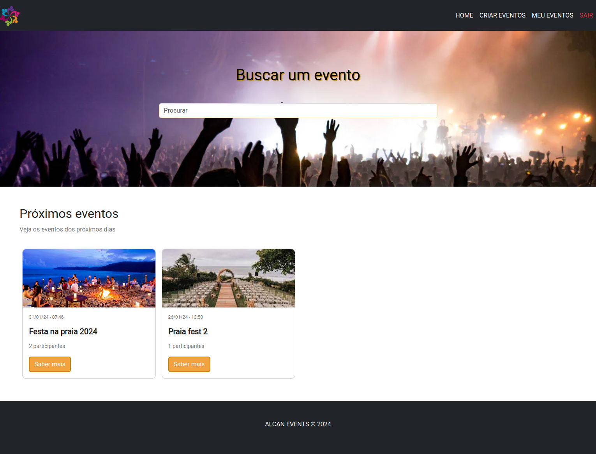
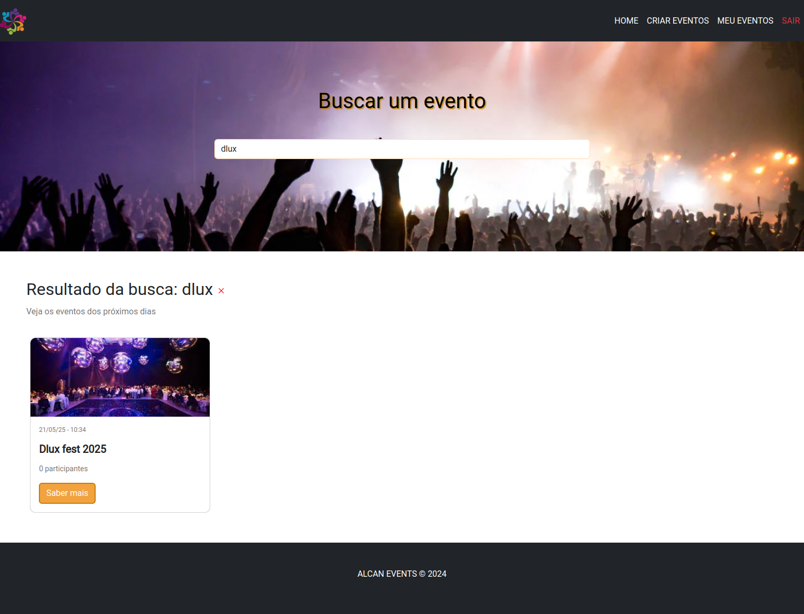
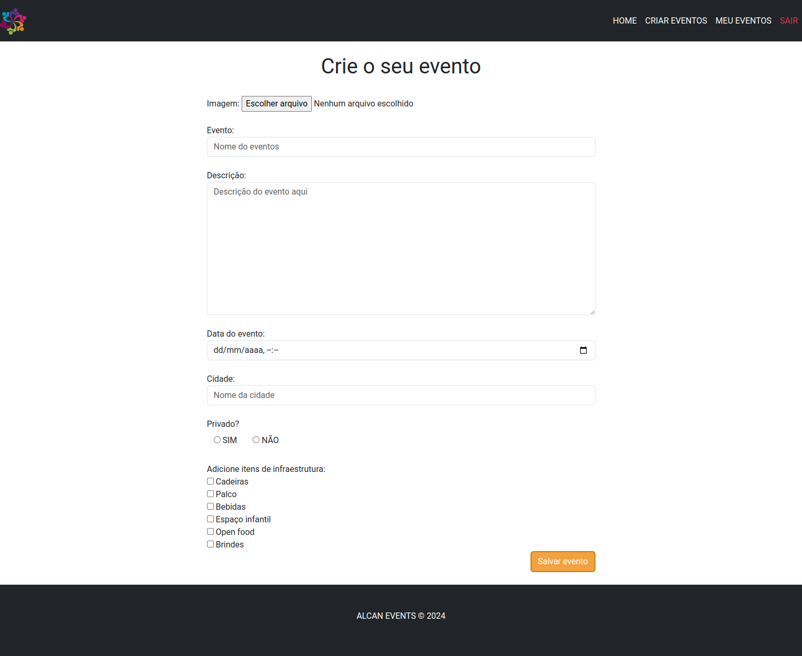
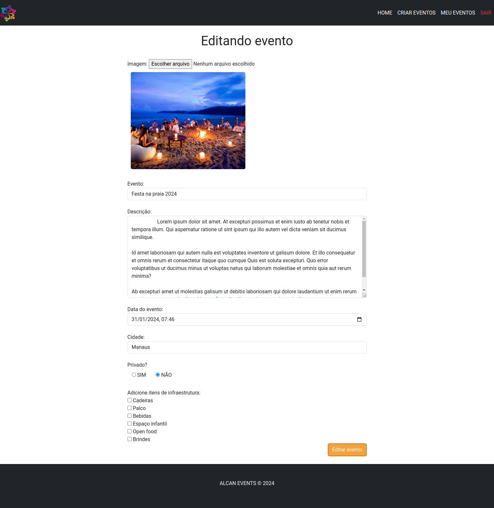
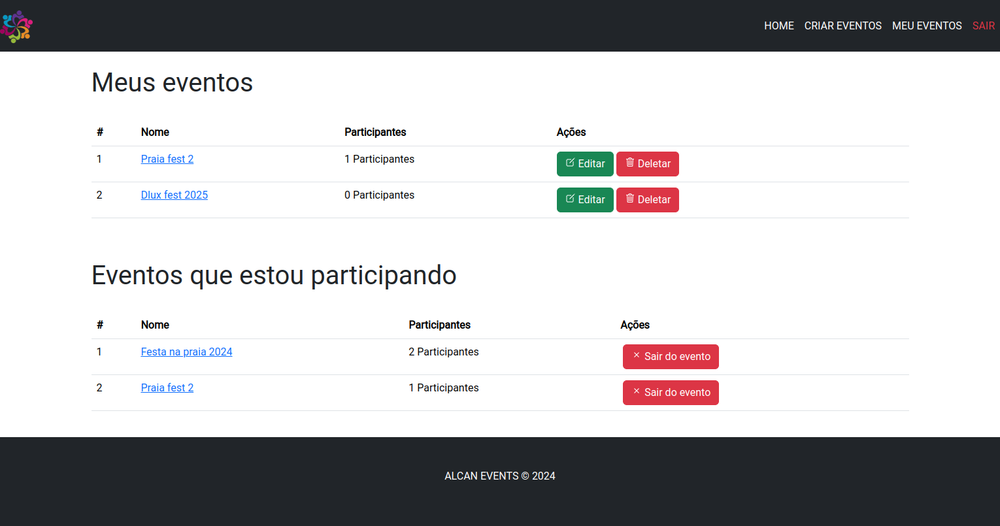
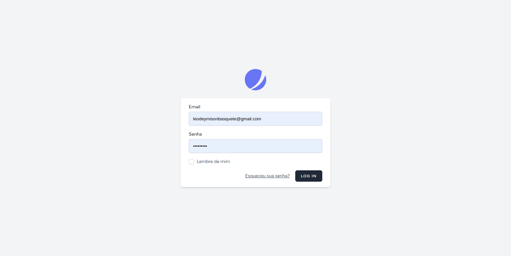
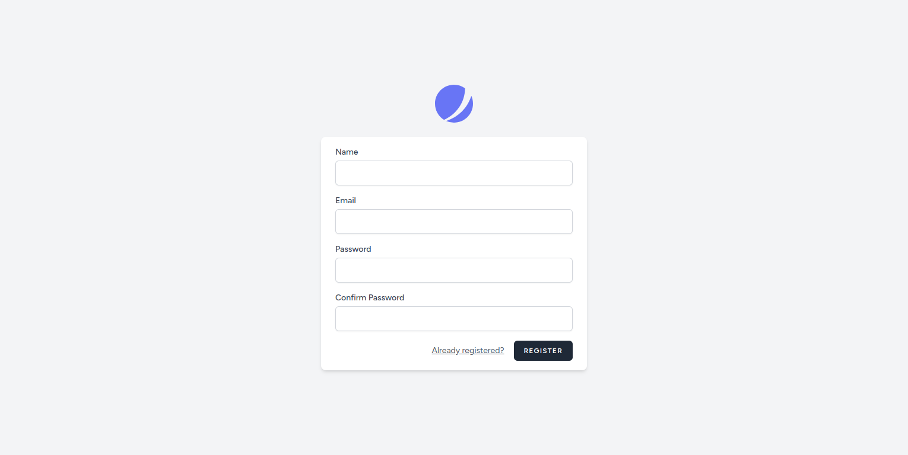

# Plataforma de eventos

## Telas

#### HOME

  

#### PESQUISAR

  

#### CRIAR EVENTO

  

#### EDITAR EVENTO

  

#### DASHBOARD

  

#### LOGIN

  

#### CRIAR USUÁRIO

  

## TECNOLOGIAS

-   MYSQL e migrations
-   PHP
-   HTML
-   BOOTSTRAP
-   CSS
-   Laravel
